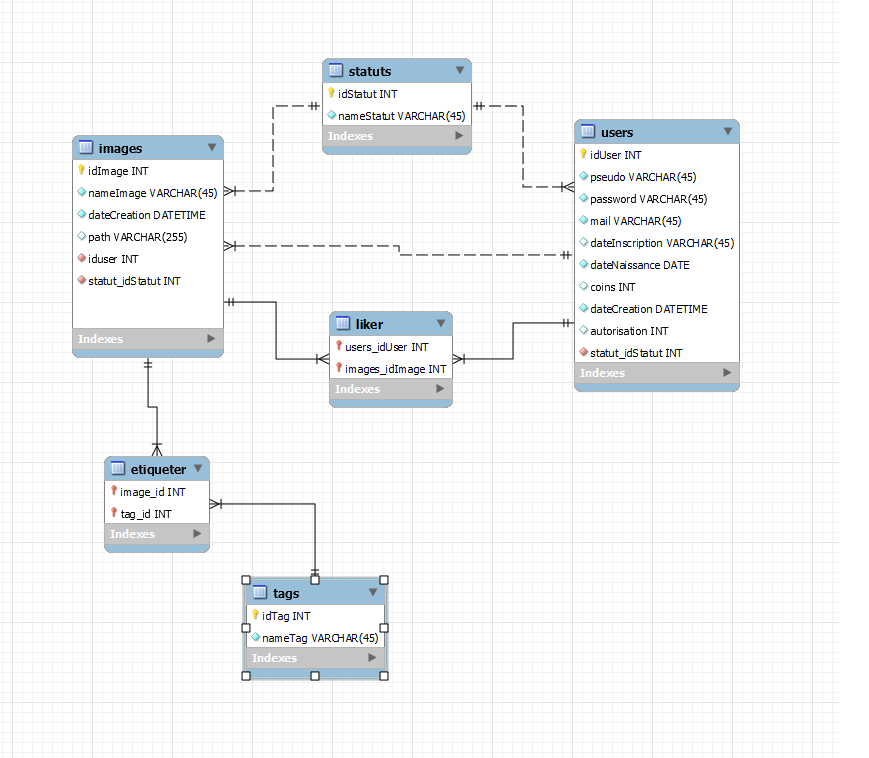
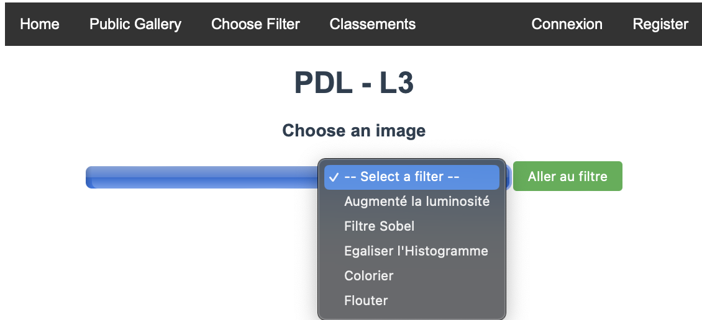
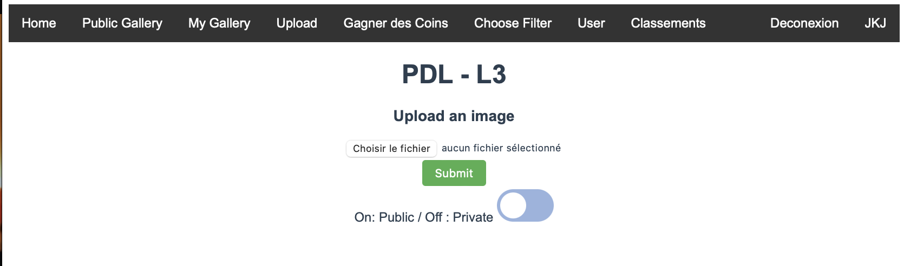
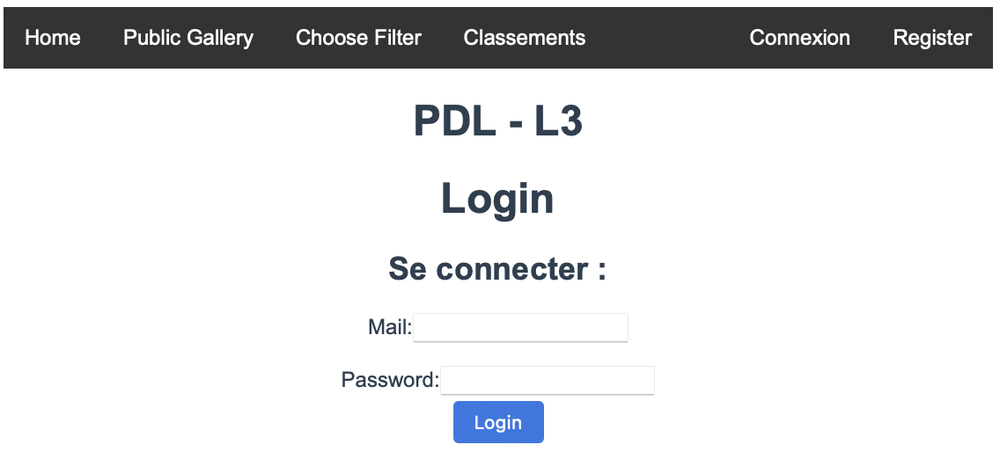
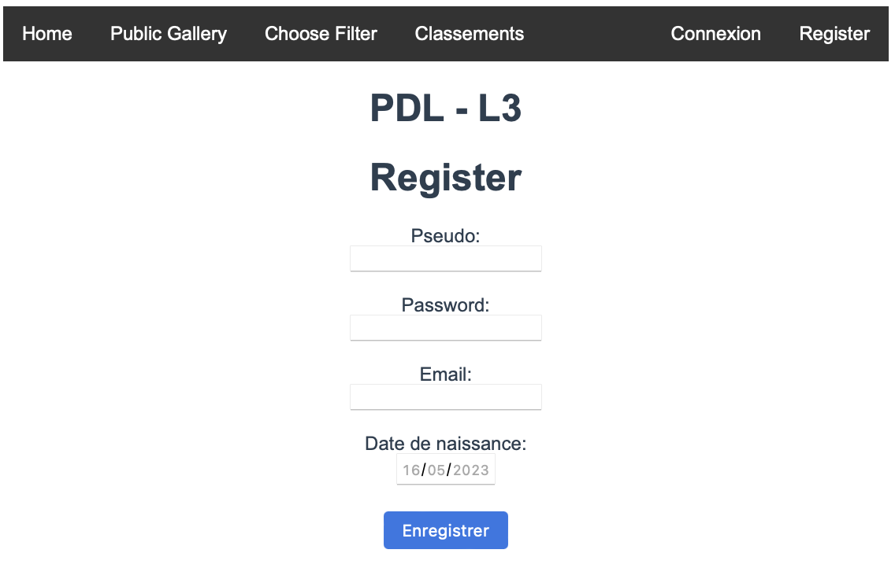
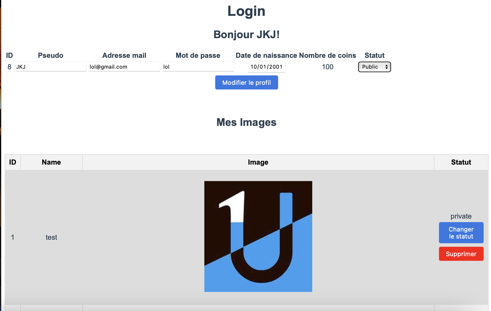
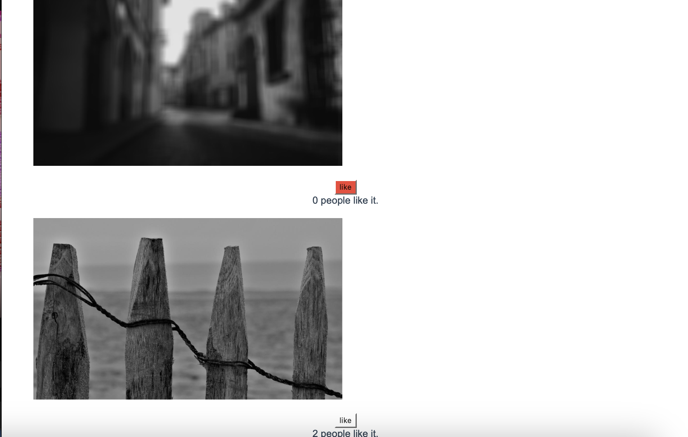
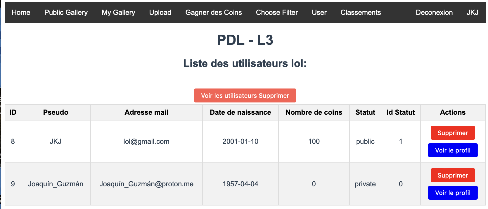

# client-serveur

Tester avec Firefox ESR version : 102.8.0
Sous environnement : Debian GNU/Linux 10/Windows 11

La base de données se nomme pdl. Les informations de connexion à la base de données sont dans le fichier sqlConnection.java.

Un exemple d'utilisateur (Admin) :
Mail : lol@gmail.com
Mot de passe : lol

Un exemple d'utilisateur classique :
Mail : obelix@gmail.com
Mot de passe : lol

## Installation et exécution

1. Accédez au répertoire pdl-client-serveur : `cd pdl-client-serveur`
2. Compilez et installez les dépendances : `mvn clean install`
3. Lancez l'application : `mvn --projects backend spring-boot:run`

## Base de données

Pour accéder à la base de données, utilisez la commande suivante :
 
mysql -u root -p
 
 

## Cahier des besoins
Ce projet vise à développer une application de traitement d'image avec une architecture client-serveur. Le document présenté décrit les besoins nécessaires à la réalisation du projet.

Noyau commun :
Chaque groupe doit implémenter le fonctionnement central de l'application client-serveur, tel que décrit dans la section 2. Cette partie du code fera l'objet d'une livraison intermédiaire.

Extensions :
Des suggestions d'extensions seront proposées en cours, telles que la répartition des charges entre client et serveur, l'amélioration de l'interface utilisateur, l'ajout de traitements d'image avancés et la généricité des algorithmes.

Serveur :

Besoin 1 : Initialiser un ensemble d'images présentes sur le serveur.
 
Besoin 2 : Gérer les images présentes sur le serveur.
 
Besoin 3 : Appliquer un algorithme de traitement d'image.
 
 
 

Communication :

Besoin 4 : Transférer la liste des images existantes.
 
Besoin 5 : Ajouter une image.
 

  
Besoin 6 : Récupération d'images.
 
Besoin 7 : Suppression d'image.
 
Besoin 8 : Exécution d'algorithmes par le serveur.
 

Client :

Besoin 9 : Parcourir les images disponibles sur le serveur (public).
 
Besoin 10 : Parcourir les images disponibles sur le serveur (utilisateur connecté).
 
Besoin 11 : Sélectionner une image et lui appliquer un effet.
 
Besoin 12 : Enregistrer une image sur disque.
 
Besoin 13 : Ajouter une image aux images disponibles sur le serveur.
 
Besoin 14 : Suppression d'image.
 

Traitement d'images :

Besoin 15 : Réglage de la luminosité.
 
Besoin 16 : Égalisation d'histogramme.
 
Besoin 17 : Filtre coloré.
 
Besoin 18 : Filtres de flou.
 
Besoin 19 : Filtre de contour.
 
Besoins non-fonctionnels :

Besoin 20 : Compatibilité du serveur.
 
Besoin 21 : Compatibilité du client.
 
Besoin 22 : Documentation d'installation et de test.
 

Résumé des ajouts :

Authentification et autorisation des utilisateurs.
 
 
 
 
 
Gestion des galeries d'images.
 
Système de "coins".
 
Profil utilisateur.
 
 
 
Classements.
 
Liker.
 
 
 
Vérification du profil.
 
 
 
Modification du statut public/privé.
 

Veuillez vous référer au cahier des besoins complet pour plus de détails.
 

Assurez-vous de remplacer "readme" par le chemin réel vers les images dans votre référentiel GitHub.

## Auteurs

- Clement Delmas
- Gabriel Marie-Brisson
